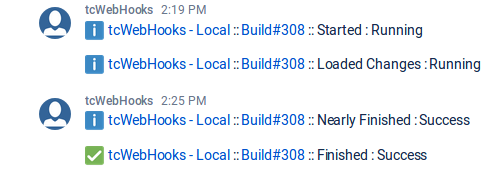

# User Contributed tcWebHooks WebHook Template

Name | Detail
---- | ------
Template Description | *Atlassian Stride Simple Message*
Template Id | *stride_simple*
Contributor | netwolfuk (github), @netwolfuk (twitter)

## Purpose
This is a very first version of a template to post to Atlassian Stride.
I plan to enhance this with feedback from the tcWebHooks community.

## Example output
It posts the messages to Stride in the following format:

 

## Installation/Configuration Instructions
After installing this template in TeamCity, follow these instructions to create am API Token in a Stride room and create a webhook in teamCity

1. Open the Atlassian Stride webUI. 
1. Open the room you want to post to from TeamCity.
1. Click the **Apps** icon in the toolbar on the right. It looks like a little bolt head.
1. In the top of the Apps panel, click the plus (+) sign to add a new "app".
1. Click **Add Custom App** in the bar near the top.
1. Select **API Tokens** and specify a token name, eg, *tcWebHooks*, or *TeamCity*. This is the name of the "user" who posts to your room.
1. Click the **Create** button. Stride will then show the API access token and URL. Keep that dialog open as you need the details to create your webhook.
1. In another browser tab or window, create a new WebHook in teamcity. See [Creating-a-WebHook](https://github.com/tcplugins/tcWebHooks/wiki/Creating-a-WebHook) for details.
1. Copy and paste the URL from the Stride dialog into the WebHook dialog.
1. Set the WebHook _Payload Format_ to **Stride Simple Message (JSON)**.
1. Choose the WebHook _Build Events_ you want to post to your Stride room.   
1. Click the _Extra Config_ tab in the WebHook dialog.
1. Choose _Bearer Token Authentication_ as the Authentication Type.
1. Switch to the Stride webapp, and copy the *Access Token*
1. Switch back to the WebHook dialog and paste it into the *Bearer Token* field.
1. Click Save, and then trigger a build. You should see messages appear in the Stride room.